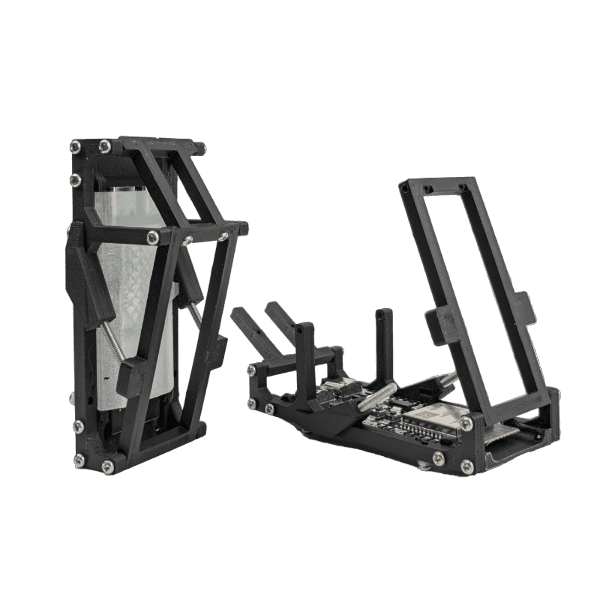
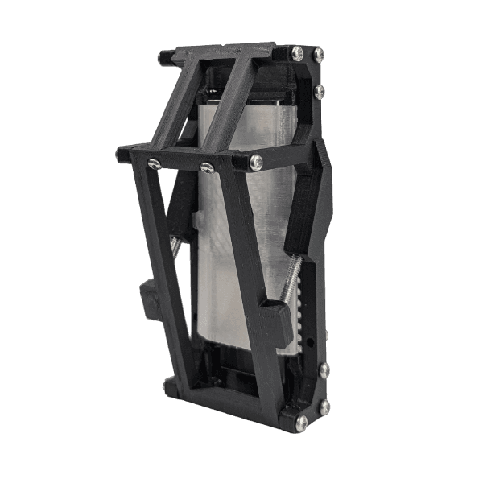
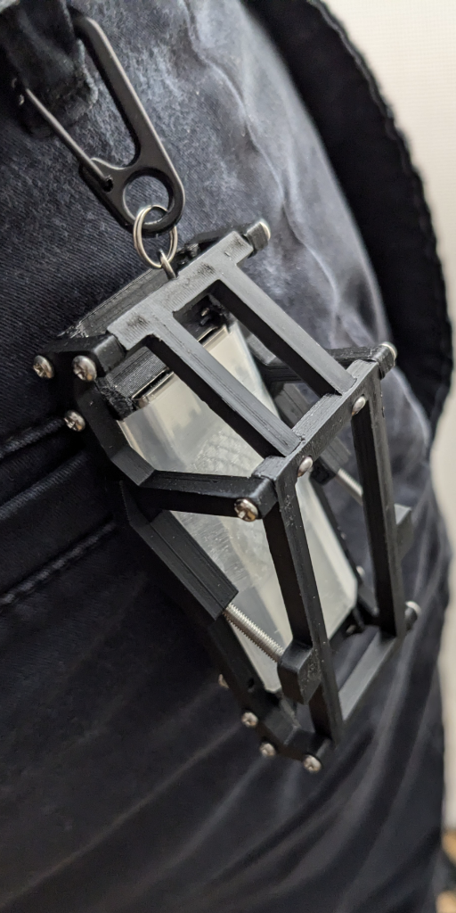

We need to put the styles in a separate css file and import it instead

We also need the flagship product image to somehow be outside of the container and be bigger, but our container and other sections need to stay the same.


Please output the full revised index.html, styles.css, and main.js 

index.html
```
<!DOCTYPE html>
<html lang="en">
	<head>
		<meta charset="UTF-8" />
		<meta name="viewport" content="width=device-width, initial-scale=1.0" />
		<title>VR Face Hug</title>
		<link rel="preconnect" href="https://fonts.gstatic.com" />
		<!-- Custom Font -->
		<link href="fonts/stealth57.ttf" rel="stylesheet" />
		<!-- Font Awesome -->
		<link
			rel="stylesheet"
			href="https://cdnjs.cloudflare.com/ajax/libs/font-awesome/4.7.0/css/font-awesome.min.css"
		/>
		<style>
			@font-face {
				font-family: "stealth57";
				src: url("fonts/stealth57.ttf") format("truetype");
				font-weight: normal;
				font-style: normal;
			}

			html {
				scroll-behavior: smooth;
			}

			/* Basic resets */
			* {
				margin: 0;
				padding: 0;
				box-sizing: border-box;
			}

			body {
				font-family: Arial, sans-serif;
				background-color: #1a1a1a;
				color: #fff;
				display: flex;
				flex-direction: column;
				align-items: center;
				min-height: 100vh;
				position: relative;
			}

			h1 {
				font-family: "stealth57", sans-serif;
				font-size: 3rem;
				font-weight: bold;
				color: #fff;
				text-align: center;
				line-height: 120%;
			}

			a {
				color: #00bfff;
			}

			/* Social buttons */
			.social-buttons {
				display: flex;
				justify-content: space-around;
				margin: 50px 0 100px 0;
				width: 100%;
				max-width: 1000px;
			}

			.social-button {
				display: inline-flex;
				align-items: center;
				justify-content: center;
				padding: 10px 15px;
				background-color: #1a1a1a;
				border: 2px solid #00bfff;
				border-radius: 5px;
				text-decoration: none;
				box-shadow: 0 0 10px rgba(0, 191, 255, 0.7);
				color: #00bfff;
				transition: all 0.3s ease;
				gap: 10px;
				font-size: 1rem;
				text-align: center;
			}

			@media (max-width: 900px) {
				.social-buttons {
					flex-direction: column;
					gap: 35px;
					width: 90%;
				}
			}

			.discord-button {
				box-shadow: 0 0 10px rgba(26, 189, 1, 0.7), 0 0 20px rgba(1, 215, 215, 0.59);
				color: #00db28;
				border: 2px solid #079d3c;
			}

			.shop-button {
				box-shadow: 0 0 10px rgba(243, 1, 150, 0.7), 0 0 20px rgba(208, 1, 111, 0.654);
				color: #e7058c;
				border: 2px solid #c80466;
			}

			.social-button svg {
				width: 32px;
				height: 32px;
			}

			.social-button:hover {
				background-color: #00bfff;
				color: #fff;
			}

			.social-button:hover svg {
				filter: brightness(0) invert(1);
			}

			/* YouTube embed */
			.youtube-embed {
				width: 100%;
				position: relative;
				padding-bottom: 56.25%;
				margin-bottom: 20px;
			}

			.youtube-embed iframe {
				position: absolute;
				top: 0;
				left: 0;
				width: 100%;
				height: 100%;
			}

			/* Unified Section Container */
			.section-container {
				width: 100%;
				max-width: 1000px;
				margin: 40px auto;
				padding: 20px;
			}

			/* Flagship Product Section (non-clickable product card) */
			.flagship .product-card {
				cursor: default;
			}

			/* Shop Section */
			.shop {
				width: 100%;
				background-color: #2a2a2a21;
				display: flex;
				flex-direction: column;
				align-items: center;
				min-height: 100vh;
				position: relative;
				margin-top: 40px;
			}

			.shop h2 {
				text-align: center;
				color: #ff7aa0;
				margin: 20px 0;
				font-size: 1.5rem;
			}

			.content {
				display: flex;
				align-items: center;
				justify-content: space-around;
				flex-wrap: wrap;
				gap: 40px;
				margin: 60px 0;
				padding: 40px;
				border-radius: 10px;
				max-width: 1000px;
			}

			.product-card {
				width: 100%;
				max-width: 1000px;
				cursor: pointer;
				position: relative;
				background-color: transparent;
				border-radius: 12px;
				box-shadow: 0 4px 6px rgba(0, 0, 0, 0.1);
				overflow: hidden;
				transition: all 0.3s ease;
			}

			.product-card.expanded {
				background-color: #333333;
				padding: 20px;
				height: auto;
			}

			.product-layout {
				display: flex;
				flex-direction: row;
				align-items: center;
				gap: 20px;
				width: 100%;
			}

			/* For tutorial cards that need a reversed layout */
			.product-layout.reverse {
				flex-direction: row-reverse;
			}

			.product-card.expanded .product-layout {
				margin-bottom: 20px;
			}

			.text-section {
				width: 45%;
				max-width: 500px;
				text-align: left;
				color: #7affb8;
				display: flex;
				flex-direction: column;
				justify-content: center;
				align-items: center;
				gap: 20px;
				padding: 20px;
			}

			.text-section h1 {
				margin-bottom: 10px;
			}

			.text-section p {
				font-size: 1.2rem;
				color: #7affa6;
				margin-top: 20px;
			}

			.contact-link {
				padding: 10px 20px;
				font-size: 1.2rem;
				text-decoration: none;
				color: #00bfff;
				background-color: #1a1a1a;
				border: 2px solid #00bfff;
				border-radius: 5px;
				text-align: center;
				transition: all 0.3s ease;
				display: inline-block;
				box-shadow: 0 0 10px rgba(0, 191, 255, 0.7);
			}

			.contact-link:hover {
				background-color: #00bfff;
				color: #fff;
				box-shadow: 0 0 20px rgba(0, 191, 255, 1);
			}

			.product-image {
				width: 45%;
				max-width: 500px;
				height: auto;
				transition: all 0.3s ease;
				border-radius: 8px;
				background-color: #4a4d4f;
			}

			.product-description {
				display: none;
				color: #b5b4b4;
				font-size: 1rem;
				line-height: 1.5;
				text-align: center;
				opacity: 0;
				transform: translateY(-20px);
				transition: opacity 0.3s ease, transform 0.3s ease;
				width: 100%;
			}

			.product-card.expanded .product-description {
				display: block;
				opacity: 1;
				transform: translateY(0);
			}

			.product-section {
				display: flex;
				flex-direction: row;
				align-items: center;
				justify-content: space-between;
				gap: 20px;
				margin-bottom: 20px;
			}

			.product-section.reverse {
				flex-direction: row-reverse;
			}

			.section-image {
				width: 65%;
				max-width: 500px;
				height: auto;
				border-radius: 8px;
			}

			.section-text {
				width: 50%;
				max-width: 500px;
				color: #b5b4b4;
				text-align: left;
			}

			.section-text h2 {
				color: #ff7aa0;
				font-size: 1.5rem;
				margin-bottom: 10px;
			}

			.section-text p {
				font-size: 1rem;
				line-height: 1.5;
			}

			@media (max-width: 768px) {
				.content {
					flex-direction: column;
					align-items: center;
				}

				.product-layout {
					flex-direction: column;
					align-items: center;
					text-align: center;
				}

				.product-image,
				.text-section {
					width: 100%;
					max-width: none;
				}

				h1 {
					font-size: 2.5rem;
				}

				p {
					font-size: 1rem;
				}
			}

			/* Log Updates Section */
			#log-updates {
				width: 100%;
				max-width: 1000px;
				margin: 40px auto;
				padding: 20px;
			}

			#log-updates h2 {
				color: #ff7aa0;
				margin-bottom: 20px;
			}

			.log-entry {
				background-color: #121213;
				border-radius: 10px;
				margin-bottom: 20px;
				overflow: hidden;
				transition: all 0.3s ease;
			}

			.log-entry-header {
				cursor: pointer;
				padding: 15px 20px;
				background-color: #1e1e1e;
				color: #ff7aa0;
				display: flex;
				justify-content: space-between;
				align-items: center;
			}

			.log-entry-header:hover {
				background-color: #2a2a2a;
			}

			.log-entry-content {
				padding: 20px;
				background-color: #161616;
				display: none;
				font-size: 0.95rem;
				line-height: 1.6;
				color: #d0d0d0;
			}

			.log-entry.expanded .log-entry-content {
				display: block;
			}

			.log-entry .toggle-icon {
				transition: transform 0.3s ease;
			}

			.log-entry.expanded .toggle-icon {
				transform: rotate(90deg);
			}

			#header {
				display: flex;
				width: 100%;
				align-items: left;
				margin-top: 10px;
				margin-bottom: 20px;
			}

			#site-header {
				font-size: 1rem;
				font-weight: bold;
				display: flex;
				align-items: left;
			}

			#site-header h1 {
				font-size: 1rem;
				font-weight: bold;
				display: flex;
				align-items: left;
				margin: 0;
			}

			.header-green {
				color: #00db28; /* Neon green */
			}

			.header-blue {
				color: #00bfff; /* Bright blue */
			}

			/* Quadrant Section Styles */
			.quadrant-grid {
				display: grid;
				grid-template-columns: repeat(2, 1fr);
				grid-template-rows: repeat(2, 1fr);
				gap: 20px;
			}

			.quadrant-item {
				display: flex;
				flex-direction: column;
				align-items: center;
				justify-content: center;
				position: relative;
				text-decoration: none;
				color: #fff;
				padding: 20px;
				border-radius: 8px;
			}

			.quadrant-item img {
				width: 100%;
				height: auto;
				border-radius: 8px;
			}

			.quadrant-title {
				position: absolute;
				bottom: 10px;
				left: 10px;
				background-color: rgba(0, 0, 0, 0.5);
				padding: 5px 10px;
				border-radius: 5px;
				font-size: 1rem;
			}

		</style>
	</head>
	<body onload="initPage();">
		<!-- Dynamic Header -->
		<div id="header"></div>

		<!-- YouTube Embed -->
		<div class="youtube-embed" id="youtube-container">
			<iframe
				id="youtube-iframe"
				src="https://www.youtube.com/embed/MW2TUWE-rEE?si=oPPUH3aN-3PR7rs1&autoplay=1"
				title="YouTube video player"
				frameborder="0"
				allow="accelerometer; autoplay; clipboard-write; encrypted-media; gyroscope; picture-in-picture; web-share"
				referrerpolicy="strict-origin-when-cross-origin"
				allowfullscreen
			></iframe>
		</div>

		<!-- Social Buttons -->
		<div class="social-buttons">
			<a
				href="https://discord.gg/PgeDHETwYq"
				target="_blank"
				class="social-button discord-button"
			>
				<div id="discord-svg"></div>
				<span>Discord</span>
			</a>
			<button type="button" id="shop-link" class="social-button shop-button">
				<div id="shop-svg"></div>
				<span>Shop</span>
			</button>
			<a
				href="https://www.youtube.com/@porchlogic"
				target="_blank"
				class="social-button"
			>
				<div id="youtube-svg"></div>
				<span>YouTube</span>
			</a>
			<a
				href="https://www.instagram.com/porchlogic"
				target="_blank"
				class="social-button"
			>
				<div id="instagram-svg"></div>
				<span>Instagram</span>
			</a>
			<a
				href="https://www.reddit.com/user/porchlogic/"
				target="_blank"
				class="social-button"
			>
				<div id="reddit-svg"></div>
				<span>Reddit</span>
			</a>
		</div>

		<!-- NEW SECTIONS ABOVE THE SHOP SECTION -->

		<!-- Flagship Product Display Section (non-clickable product card) -->
		<section class="flagship section-container" id="flagship">
			<div class="product-card">
				<div class="product-layout reverse">
					<div class="text-section">
						<h1>SMB1</h1>
						<p>
							synchronize music gear
							synchronize phone/tablet
							
						</p>
					</div>
					
				</div>
			</div>
		</section>
		

		<!-- Full-Width Image Section with Top-Left Title -->
		<section class="fullwidth-image section-container" id="fullwidth-image">
			<div class="fullwidth-image-container" style="position: relative;">
				
				<h2
				>
					Urban Encounter
				</h2>
			</div>
		</section>

		<!-- Tutorials Section -->
		<section class="tutorials section-container" id="tutorials">
			<h2>Tutorials</h2>
			<div class="content">
				<a href="https://example.com/tutorial1" class="product-card tutorial-card">
					<div class="product-layout">
						
						<div class="text-section">
							<h1>Tutorial 1</h1>
							<p>Learn how to use our flagship features.</p>
						</div>
					</div>
				</a>
				<a href="https://example.com/tutorial2" class="product-card tutorial-card">
					<div class="product-layout">
						
						<div class="text-section">
							<h1>Tutorial 2</h1>
							<p>Advanced techniques and tips.</p>
						</div>
					</div>
				</a>
			</div>
		</section>
		

		<!-- Quadrant Layout Section -->
		<section class="quadrant section-container" id="quadrant">
			<h2>Our Features</h2>
			<div class="quadrant-grid">
				<a href="https://example.com/link1" class="quadrant-item" style="background-color: #2a2a2a;">
					
					<div class="quadrant-title">Feature 1</div>
				</a>
				<a href="https://example.com/link2" class="quadrant-item" style="background-color: #252525;">
					
					<div class="quadrant-title">Feature 2</div>
				</a>
				<a href="https://example.com/link3" class="quadrant-item" style="background-color: #202020;">
					
					<div class="quadrant-title">Feature 3</div>
				</a>
				<a href="https://example.com/link4" class="quadrant-item" style="background-color: #1d1d1d;">
					
					<div class="quadrant-title">Feature 4</div>
				</a>
			</div>
		</section>
		

		<!-- Existing Shop Section -->
		<section class="shop section-container" id="shop">
			<h2>Shop</h2>
			<div class="content">
				<!-- CPMicro1 Product Card -->
				<div class="product-card" onclick="toggleCard(this)">
					<div class="product-layout">
						<div class="text-section">
							<h1>CPMicro1</h1>
							<p>Wireless MIDI Orchestra</p>
							<a
								href="https://buy.stripe.com/14k6sv8C0bVi9qw289"
								class="contact-link"
							>
								$42</a
							>
						</div>
						
					</div>
					<div class="product-description">
						<div class="product-section">
							
							<div class="section-text">
								<h2>About CPMicro1</h2>
								<p>
									Support PorchLogic with this micro version of the cyberPack.
								</p>
							</div>
						</div>
						<div class="product-section reverse">
							<div class="section-text">
								<h2>On the Move</h2>
								<p>
									Carry it with you around the metropolis and sync your sounds
									with nearby cyborgs.
								</p>
							</div>
							
						</div>
					</div>
				</div>

				<!-- VR Face Hug Product Card -->
				<div class="product-card" onclick="toggleCard(this)">
					<div class="product-layout">
						<div class="text-section">
							<h1>VR Face Hug</h1>
							<p>
								A bespoke pillow that perfectly molds to your face,<br />
								works with the Quest 3
							</p>
							<a href="mailto:fits@porchlogic.com" class="contact-link">
								Get in touch for your custom fitting
							</a>
						</div>
						
					</div>
					<div class="product-description">
						<div class="product-section">
							<div class="section-text">
								<h2>Custom Crafted</h2>
								<p>
									Designed to provide a perfect fit while you experience VR.
								</p>
							</div>
						</div>
						<div class="product-section reverse">
							<div class="section-text">
								<h2>Innovative Comfort</h2>
								<p>
									Contact us for your custom fitting and experience a new level of
									immersion.
								</p>
							</div>
						</div>
					</div>
				</div>
			</div>
		</section>

		<!-- Log Updates Section (Populated Dynamically) -->
		<section id="log-updates">
			<h2>Log Updates</h2>
			<!-- Log entries from Markdown will be injected here -->
		</section>

		<!-- Dynamic Footer -->
		<div id="footer"></div>

		<!-- Include Marked.js for Markdown conversion -->
		<script src="https://cdnjs.cloudflare.com/ajax/libs/marked/4.2.12/marked.min.js"></script>
		<!-- Main JavaScript -->
		<script src="js/main.js"></script>
	</body>
</html>

```
main.js
```
// Load HTML fragment into an element by ID
function loadHTML(elementId, file) {
	fetch(file)
		.then((response) => response.text())
		.then((data) => {
			document.getElementById(elementId).innerHTML = data;
		})
		.catch((err) => console.error(`Error loading ${file}:`, err));
}

// Toggle product card expansion
function toggleCard(card) {
	const isExpanded = card.classList.contains("expanded");
	document.querySelectorAll(".product-card").forEach((c) =>
		c.classList.remove("expanded")
	);
	if (!isExpanded) card.classList.add("expanded");
}

// Load log updates from markdown files listed in updates.json
function loadLogUpdates() {
	fetch("log/updates.json")
		.then((response) => response.json())
		.then((data) => {
			const container = document.getElementById("log-updates");
			data.updates.forEach((mdFile, index) => {
				fetch(`log/${mdFile}`)
					.then((resp) => resp.text())
					.then((mdContent) => {
						const htmlContent = marked.parse(mdContent);
						const logEntry = document.createElement("div");
						logEntry.className = "log-entry";

						const header = document.createElement("div");
						header.className = "log-entry-header";
						header.innerHTML = `<span>Update ${index + 1}</span><i class="fa fa-chevron-right toggle-icon"></i>`;

						const content = document.createElement("div");
						content.className = "log-entry-content";
						content.innerHTML = htmlContent;

						logEntry.appendChild(header);
						logEntry.appendChild(content);

						header.addEventListener("click", () => {
							const isExpanded = logEntry.classList.contains("expanded");
							document.querySelectorAll(".log-entry").forEach((entry) => {
								entry.classList.remove("expanded");
							});
							if (!isExpanded) {
								logEntry.classList.add("expanded");
							}
						});

						container.appendChild(logEntry);
					})
					.catch((err) =>
						console.error(`Error loading markdown file ${mdFile}:`, err)
					);
			});
		})
		.catch((err) => console.error("Error loading updates.json:", err));
}

// Load SVG markup from JSON and inject into corresponding elements
function loadSVGData() {
	fetch("data/svgData.json")
		.then((response) => response.json())
		.then((data) => {
			document.getElementById("discord-svg").innerHTML = data.discord;
			document.getElementById("shop-svg").innerHTML = data.shop;
			document.getElementById("youtube-svg").innerHTML = data.youtube;
			document.getElementById("instagram-svg").innerHTML = data.instagram;
			document.getElementById("reddit-svg").innerHTML = data.reddit;
		})
		.catch((err) => console.error("Error loading SVG data:", err));
}

// Initialize the page by loading dynamic content and attaching events
function initPage() {
	loadHTML("header", "header.html");
	loadHTML("footer", "footer.html");
	loadLogUpdates();
	loadSVGData();

	// Scroll to shop section when shop button is clicked
	const shopLink = document.getElementById("shop-link");
	const shopSection = document.getElementById("shop");
	shopLink.addEventListener("click", () => {
		shopSection.scrollIntoView({ behavior: "smooth", block: "end" });
	});
}

```